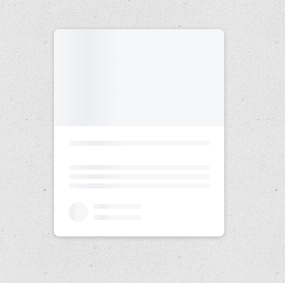

# Content Placeholder

> Content placeholder widget on vanilla js

### [Demo](http://content-placeholder-ab.surge.sh)
[](https://skr.sh/v60jOrPoX1A?a)

### Get started

```shell script
git clone
```
```shell script
open index.html
```
or
```shell script
npm i -g live-server
```
```shell script
live-server
```
